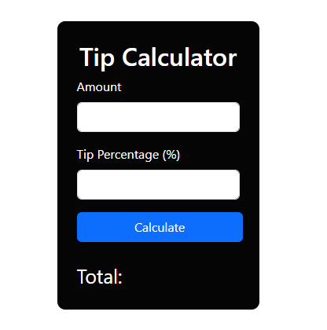

# 💰 Tip Calculator

A simple and responsive **Tip Calculator** built using **HTML, CSS, Bootstrap, and JavaScript**.  
Easily calculate the tip amount and split the bill between people.

---

## 🚀 Demo

🔗 [Live Demo](https://coding-smit.github.io/tip-calculator/) &nbsp; *(Replace with your GitHub Pages or live site URL)*

---

## 🖼️ Preview

 <!-- Replace with actual path if available -->

---

## ✨ Features

- ✅ **Real-time Tip Calculation**
- 💸 Select **preset or custom tip percentages**
- 👥 **Split bill** among multiple people
- 📱 **Fully responsive UI** using Bootstrap 5
- 🧼 **Reset/Clear** button
- ❌ **Input validation** for clean UX

---

## 🛠️ Tech Stack

- **HTML5**
- **CSS3**
- **Bootstrap 5**
- **JavaScript (Vanilla)**

---

## 📂 Project Structure

```bash
tip-calculator/
├── index.html
├── style.css
├── script.js
├── README.md
└── assets/
    └── screenshot.png
